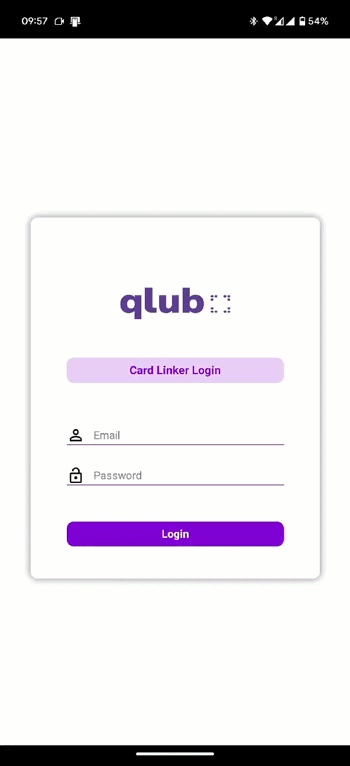

# Card Linker Release Notes - Version 1.0.0

**Release Date**: Sep 11, 2023

## Overview:

Card Linker is a Progressive Web App (PWA) designed to streamline the process of linking restaurant tables to designated cards for order redirection.

## Features:

1. **Unique Login for Restaurants**: Each restaurant has its own unique login, ensuring data privacy and security.
2. **Interactive Dashboard**: Upon login, users are greeted with a list of tables available for their restaurant along with a search bar to easily find and select tables.
3. **Table Description**: When a table is selected, a brief description of the table is displayed, providing the user with context about the table's current state or any other relevant details.
4. **Card Linking Process**:
   - Users are prompted to select a card (from A to H) after choosing a table.
   - A confirmation screen displays the chosen table and card after selecting a card.
   - Users have the flexibility to navigate back and modify their choices before finalizing.
   - Once confirmed, the backend server updates the link, thereby linking the table to the selected card.

## Tech Stack:

- Frontend: React JS
- Backend: Supabase, Python
- Data Storage: Upstash Redis
- Deployment & Amplification: AWS Amplify

## Known Issues:

- The app currently does not indicate which table is linked to which card and vice versa. This might result in potential operational challenges for the users.